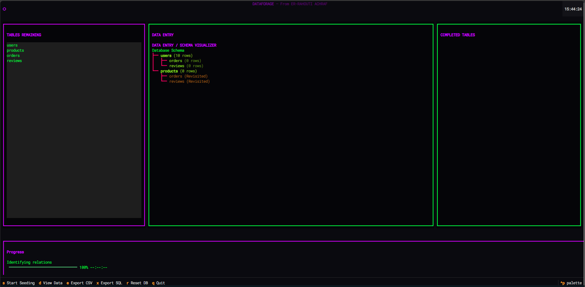
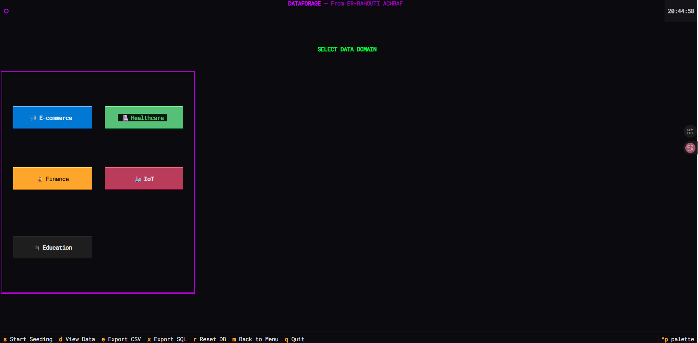

# DataForge

**A high-performance database seeding tool with a Terminal User Interface (TUI) and AI-powered data generation using Ollama.**



---

## Features

- **AI-Powered Generation** - Uses Ollama (qwen) to generate realistic text for bios, diagnoses, and reviews.
- **Domain Selection** - Choose from custom schemas: E-commerce, Healthcare, Finance, IoT, and Education.
- **Hierarchical Seeding** - Intelligent foreign key resolution ensures data integrity across complex schemas.
- **Organized Exports** - Automatic sorting into domain-specific subfolders (e.g., `exports/healthcare/`).
- **High Performance** - Multiprocessing for parallel data generation.
- **Beautiful TUI** - Cyberpunk-themed terminal interface built with Textual.
- **Browser Access** - Run in Chrome via `textual serve`.

---

## Screenshots

### Domain Selection
Start the app and select your target industry. DataForge will automatically architect the appropriate schema.



### Main Interface
The main dashboard shows three columns: Tables Remaining, Schema Visualizer, and Completed Tables.


---

## Quick Start

### 1. Install Dependencies
```bash
pip install -r requirements.txt
```

### 2. Run DataForge (Recommended)
Use the batch controller for quick access to all modes:
```bash
./run.bat
```

**Manual Modes:**
- **TUI Dashboard:** `python main.py`
- **Web Interface:** `textual serve --port 8080 --command "python main.py"`
- **Standalone CLI:** `python universal_generator.py`

---

## Project Structure

```
DATAFORAGE/
├── main.py              # Entry point
├── run.bat              # Project controller
├── project_stats.py     # Health dashboard
├── config/
│   └── settings.yaml    # Configuration (qwen model, workers)
├── core/
│   ├── db_connector.py  # Domain-specific schema architect
│   ├── generator.py     # Cross-industry logic engine
│   └── ai_agent.py      # Ollama integration
├── ui/
│   ├── tui_app.py       # Multi-screen Textual application
│   └── styles.tcss      # Cyberpunk design system
├── exports/             # Domain-organized CSV/SQL outputs
│   ├── ecommerce/
│   ├── healthcare/
│   └── ...
└── dataforge.db         # Industry-specific SQLite DB
```

---

## Export Formats

### Organized CSV Export
Exports are neatly sorted by domain:
- `exports/ecommerce/users.csv`
- `exports/healthcare/patients.csv`
- `exports/finance/transactions.csv`

### SQL Export
A complete industry-specific SQL dump is generated at `exports/dataforge_dump.sql`.

---

## Development

```bash
# Run tests
python test_seed.py

# View generated data
python view_data.py

# Test Ollama connection
python test_ollama.py

# Setup database schema
python setup_db.py
```

---

## Dependencies

- textual >= 0.40.0
- faker >= 20.0.0
- pyyaml >= 6.0
- rich >= 13.0.0
- requests >= 2.31.0

---

## Utility Scripts

To make development easier, we've included several utility scripts:

- `run.bat` - The central control hub for the project.
- `project_stats.py` - Quick visual summary of your database and exports.
- `universal_generator.py` - Standalone CSV generator for cross-industry data.
- `.env.example` - Template for your environment configurations.

---

## 🛠️ Technical Stack

- **Interface**: Textual (TUI), Rich (CLI)
- **Engine**: Python Multiprocessing, Faker
- **AI**: Ollama (AI Agent)
- **Database**: SQLite3 / PostgreSQL Support
- **Graph Logic**: NetworkX (Dependency Resolution)

---

## License

MIT License - Created by **ER-RAHOUTI ACHRAF**
