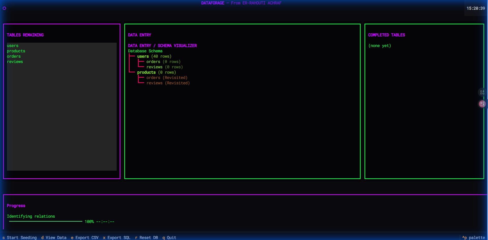
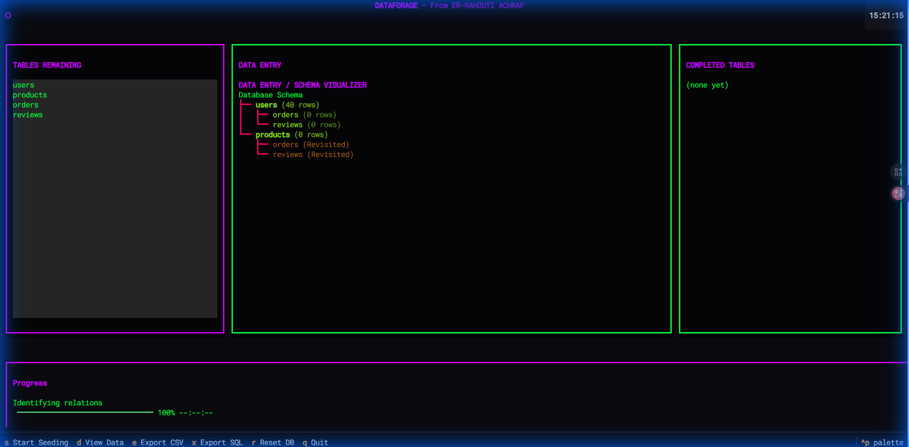
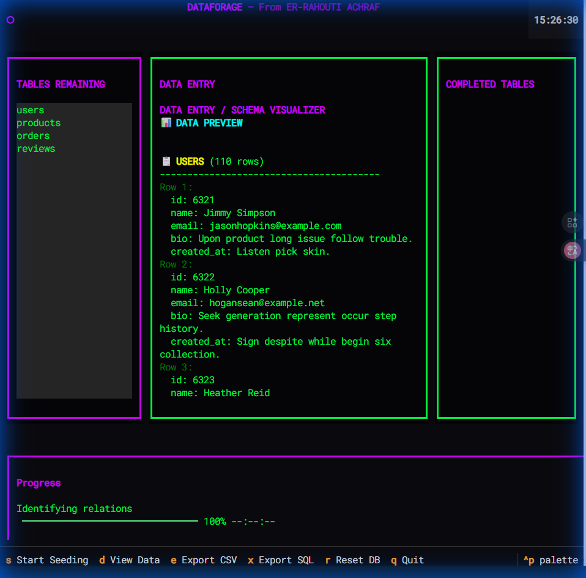
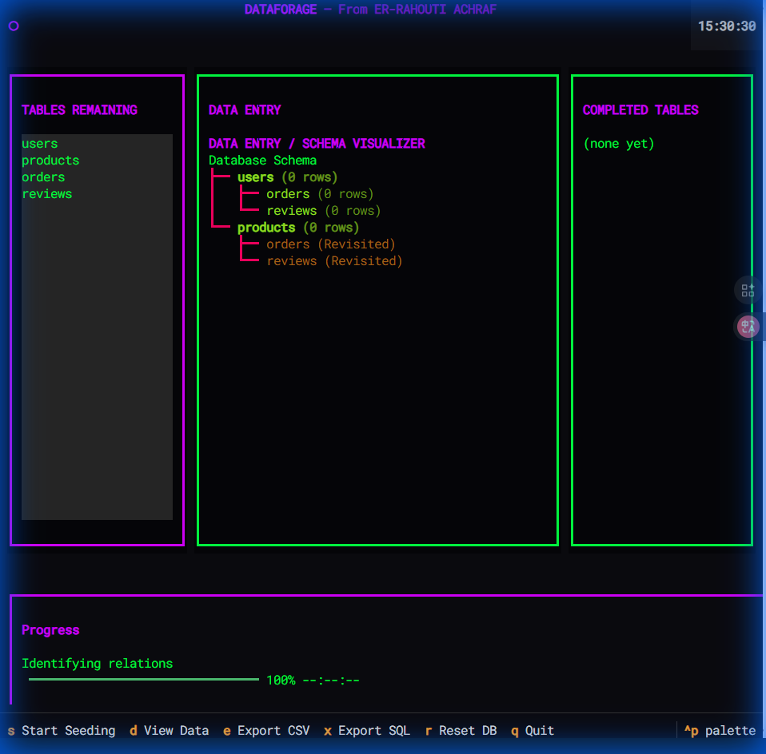

# DataForge

**A high-performance database seeding tool with a Terminal User Interface (TUI) and AI-powered data generation using Ollama.**


---

## Features

- **AI-Powered Generation** - Uses Ollama (qwen3) to generate realistic text for bios, descriptions, and comments
- **High Performance** - Multiprocessing for parallel data generation
- **Beautiful TUI** - Cyberpunk-themed terminal interface built with Textual
- **Schema Visualizer** - Database structure displayed as an ASCII tree with live row counts
- **Browser Access** - Run in Chrome via `textual serve`
- **SQLite Built-in** - No external database setup required
- **Export Support** - Export data to CSV and SQL formats

---

## Screenshots

### Main Interface
The main dashboard shows three columns: Tables Remaining, Schema Visualizer, and Completed Tables.


### Seeding in Progress
Press `s` to start seeding. Watch as data is generated in real-time with live row counts.



### Seeding Complete
The schema visualizer shows the number of rows generated for each table.



### Data Preview
Press `d` to view the generated data. Browse through users, products, orders, and reviews.



### Reset Database
Press `r` to reset the database and clear all data.



---

## Quick Start

### 1. Install Dependencies
```bash
pip install -r requirements.txt
```

### 2. Start Ollama (for AI mode)
```bash
ollama serve
ollama pull qwen3
```

### 3. Run DataForge

**Terminal Mode:**
```bash
python main.py
```

**Browser Mode:**
```bash
textual serve --port 8080 --command "python main.py"
# Open http://localhost:8080 in Chrome
```

### Keyboard Shortcuts

| Key | Action |
|-----|--------|
| `s` | Start Seeding |
| `d` | View Data Preview |
| `e` | Export to CSV |
| `x` | Export to SQL |
| `r` | Reset Database |
| `q` | Quit Application |

---

## Project Structure

```
DATAFORAGE/
├── main.py              # Entry point
├── config/
│   └── settings.yaml    # Configuration (AI, batch size, workers)
├── core/
│   ├── db_connector.py  # SQLite database connector
│   ├── schema_parser.py # Schema analysis & dependency graph
│   ├── generator.py     # Data generation with AI/Faker
│   └── ai_agent.py      # Ollama API integration
├── ui/
│   ├── tui_app.py       # Textual TUI application
│   ├── panels.py        # UI panels (tables, visualizer, logs)
│   ├── visualizer.py    # Schema tree visualizer
│   └── styles.tcss      # TUI styles
├── exports/             # Exported CSV and SQL files
├── screenshots/         # Documentation screenshots
└── dataforge.db         # SQLite database (auto-created)
```

---

## Configuration

Edit `config/settings.yaml`:

```yaml
generation:
  batch_size: 10      # Rows per batch
  workers: 2          # Parallel workers
  use_ai_mode: true   # Enable/disable AI generation

ai:
  api_url: "http://localhost:11434/api/generate"
  model: "qwen3:latest"
```

---

## Database Schema

| Table | Fields | AI-Generated |
|-------|--------|--------------|
| users | id, name, email, bio, created_at | bio |
| products | id, name, description, price | description |
| orders | id, user_id, product_id, quantity | - |
| reviews | id, user_id, product_id, comment, rating | comment |

---

## Export Formats

### CSV Export
Each table is exported to a separate CSV file in the `exports/` directory:
- `users.csv` - User data with names, emails, and AI-generated bios
- `products.csv` - Product catalog with descriptions
- `orders.csv` - Order records linking users to products
- `reviews.csv` - User reviews with AI-generated comments

### SQL Export
A complete SQL dump is generated at `exports/dataforge_dump.sql` containing INSERT statements for all records.

---

## Development

```bash
# Run tests
python test_seed.py

# View generated data
python view_data.py

# Test Ollama connection
python test_ollama.py

# Setup database schema
python setup_db.py
```

---

## Dependencies

- textual >= 0.40.0
- faker >= 20.0.0
- pyyaml >= 6.0
- rich >= 13.0.0
- requests >= 2.31.0

---

## License

MIT License - Created by **ER-RAHOUTI ACHRAF**
